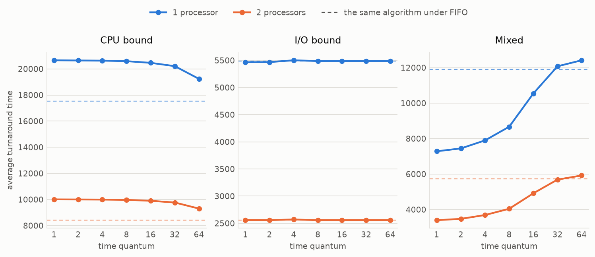
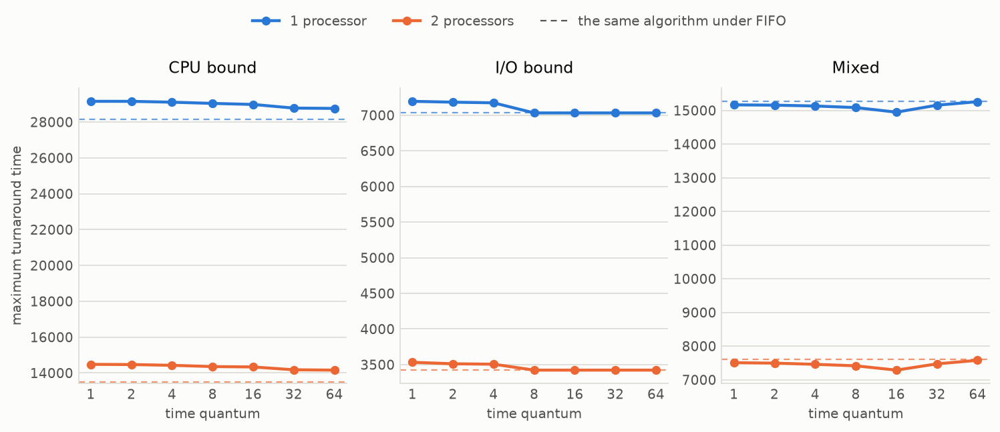
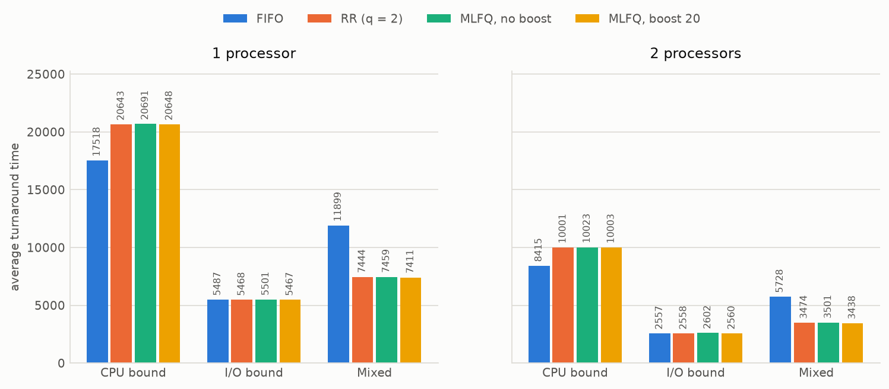
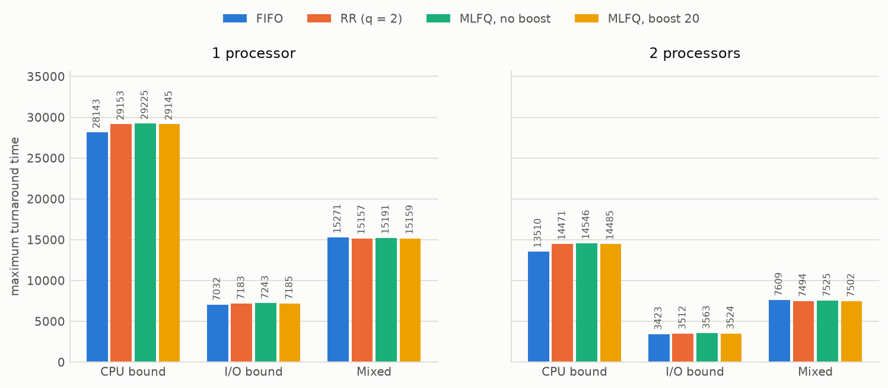
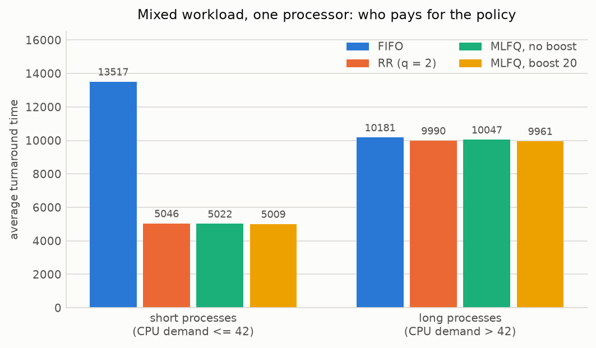
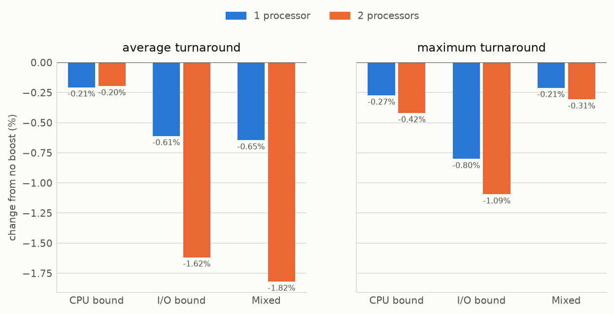
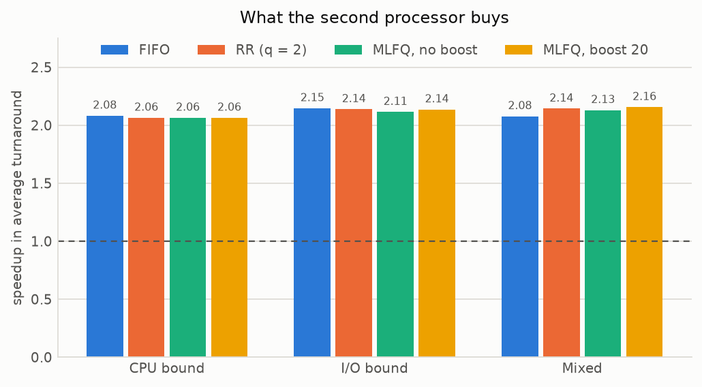
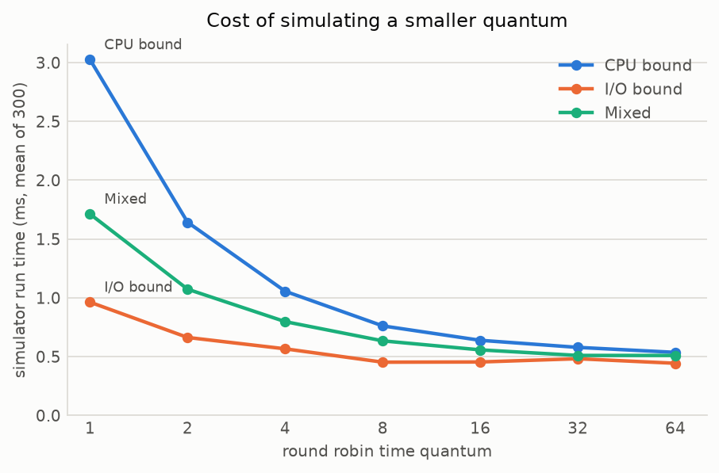

# Laboratory 3 — Process Scheduling

**cs24bt007, cs24bt054**

A discrete time simulator for FIFO, round robin and MLFQ scheduling, evaluated on
one and on two processors.

---

## 1. The simulator

`src/scheduler.cpp` builds to a single binary:

```
./scheduler.out <scheduling-algorithm> <path-to-workload-description-file> [options]
```

`<scheduling-algorithm>` is `FIFO`, `RR` or `MLFQ`. Everything an individual
experiment varies is an optional flag with a default, so the two argument form
required by the assignment always works:

| Option | Meaning | Default |
|---|---|---|
| `--quantum <n>` | time quantum, `RR` and `MLFQ` only | 4 for `RR`, 2 for `MLFQ` |
| `--boost <n>` | MLFQ priority boost period, 0 disables it | 0 |
| `--cpus <n>` | number of processors | 1 |
| `--schedule <f>` | write the schedule to `f` rather than to standard output | standard output |
| `--per-process <f>` | write one row of statistics per process to `f` | not written |
| `--repeat <n>` | simulate `n` times, report the mean run time | 1 |
| `--csv` | print the statistics as one comma separated line | off |

It reports average and maximum turnaround time, the makespan, its own run time
with the file reading and schedule printing excluded, and the schedule in the
format of `schedule_format.txt`.

### 1.1 Model of time

Time advances in unit ticks. Tick *t* covers the half open interval [*t*, *t*+1),
and a schedule line `P3,2  40  47` means process 3 held a processor for every
tick from 40 to 47 inclusive — which is why consecutive segments in
`schedule_format.txt` start one unit after the previous one ends.

Within a single instant the simulator does things in a fixed order: new arrivals
enter the ready queue, then processes whose I/O has completed, then processes
that lost the processor at exactly this instant. A process that has just been
preempted therefore goes behind one that arrived at the same moment, which is
the conventional round robin behaviour.

### 1.2 Assumptions

These are not pinned down by the handout, so they are stated here explicitly.

* **I/O never queues.** Each process performs its I/O independently; an I/O burst
  of length *k* started at time *t* finishes at *t* + *k* regardless of how many
  other processes are also in I/O. Modelling a single shared device would turn
  the experiment into a study of the device rather than of the CPU scheduler.
* **Context switches are free.** No cost is charged for a preemption or a
  dispatch. This is deliberate: it isolates the effect of the *policy*. It also
  means the results below understate the cost of a small quantum, which is
  discussed in section 6.
* **Demotion rule for MLFQ.** A process that consumes an entire time slice drops
  one level; a process that releases the processor early — because its CPU burst
  ended and it went to I/O — stays at its current level. This is the textbook
  rule, and it is what makes the priority boost worth studying at all.
* **A process returning from I/O** re-enters the queue it was in when it left,
  and is given a fresh quantum.
* **On two processors** the ready queue is shared and the lower numbered idle
  processor is filled first. A process never runs on both processors at once.

### 1.3 Correctness checks

Every schedule the simulator produced for the experiments below was checked
mechanically: no processor runs two processes at once, no process runs on two
processors at once, each process receives exactly the CPU time each of its bursts
asks for, nothing is scheduled before its arrival time, and the gap between
consecutive CPU bursts of a process is at least its I/O burst. All 48
algorithm/quantum/processor combinations pass on all three workloads.

---

## 2. Workloads

> **Note.** The workload files linked from the handout live in a Google Drive
> folder. `src/generate_workloads.py` produces three stand-in workloads of 200
> processes each so that the whole pipeline runs from a clean checkout. To use
> the provided files instead, drop them into `src/workloads/` and re-run
> `bash run_experiments.sh` — nothing else changes.

| Workload | Processes | Total CPU work | Total I/O work | Mean CPU burst | Mean I/O burst | CPU bursts per process |
|---|---|---|---|---|---|---|
| CPU bound | 200 | 29 344 | 993 | 72.6 | 4.9 | 2.0 |
| I/O bound | 200 | 7 326 | 57 604 | 4.5 | 40.0 | 8.2 |
| Mixed | 200 | 15 384 | 38 366 | 9.5 | 27.1 | 8.1 |

The mixed workload is 150 interactive processes (short bursts, long I/O) with 50
batch processes (bursts of 60–200) stirred in. It is the interesting one: the
other two are controls that show what the algorithms do when the workload is
uniform.

---

## 3. Round robin: the effect of the time quantum





The three panels behave completely differently, and the reason in each case is a
property of the workload rather than of the algorithm.

**CPU bound.** Round robin is worse than FIFO at every quantum, and improves
monotonically as the quantum grows. This is the expected result: when every
process wants a long, roughly equal slab of CPU, slicing the processor between
them finishes *everybody* later. FIFO runs a process to completion and gets it
out of the system; round robin interleaves 200 processes so that they all finish
near the end. The curve is walking towards the FIFO line — round robin with an
unbounded quantum *is* FIFO — but even at q = 64 it is still 9.8 % worse, because
the mean CPU burst is 72.6 and most bursts are still being chopped.

**I/O bound.** The quantum makes essentially no difference (a spread of 0.6 %),
and from q = 8 upwards round robin produces numbers *identical* to FIFO —
5487.22 / 7032 / 7326 to the digit. The reason is direct: no CPU burst in this
workload exceeds 8, so a quantum of 8 or more never fires, and the algorithm
degenerates into FIFO. More generally this workload spends 57 604 units in I/O
against 7 326 units of CPU work; the processor is not the bottleneck, so the CPU
policy has almost nothing to influence.

**Mixed.** Here the trend reverses: the *smaller* the quantum the better, and the
gap is large. q = 1 gives 7 284 against FIFO's 11 899, a 38.8 % improvement, and
by q = 32 round robin has given the whole advantage back. This is the convoy
effect. Fifty batch processes with bursts of up to 200 units sit in front of 150
interactive processes that only want a few units each; under FIFO every short
process waits behind a long one. A small quantum breaks the convoy.

Note that **maximum** turnaround barely moves in any panel — between 14 949 and
15 271 across the whole mixed sweep. The maximum is set by the longest process,
and the longest process finishes near the end of the run whatever the policy
does. Average and maximum turnaround are answering different questions, and only
the average is sensitive to the scheduling policy here.

---

## 4. The three algorithms compared





Taking RR at q = 2 and MLFQ at its specified quantum of 2:

| Workload | Processors | FIFO | Best RR | MLFQ, no boost | MLFQ, boost 20 |
|---|---|---|---|---|---|
| CPU bound | 1 | **17 518** | 19 235 (q = 64, +9.8 %) | 20 691 (+18.1 %) | 20 648 (+17.9 %) |
| CPU bound | 2 | **8 415** | 9 303 (q = 64, +10.6 %) | 10 023 (+19.1 %) | 10 003 (+18.9 %) |
| I/O bound | 1 | 5 487 | **5 466** (q = 1, −0.4 %) | 5 501 (+0.2 %) | 5 467 (−0.4 %) |
| I/O bound | 2 | **2 557** | 2 557 (q = 8, ±0 %) | 2 602 (+1.8 %) | 2 560 (+0.1 %) |
| Mixed | 1 | 11 899 | **7 284** (q = 1, −38.8 %) | 7 459 (−37.3 %) | 7 411 (−37.7 %) |
| Mixed | 2 | 5 728 | **3 399** (q = 1, −40.7 %) | 3 501 (−38.9 %) | 3 438 (−40.0 %) |

Read as aggregate averages this is an awkward result for MLFQ: it never wins. It
is the worst of the three on the CPU bound workload and it is marginally behind
round robin on the mixed workload. That conclusion is real but incomplete, and
section 5 is where the picture changes.

The honest summary of the aggregate numbers is:

* **FIFO** is the best policy when the workload is uniform and CPU bound, and it
  is free — no preemption machinery at all. It is catastrophic as soon as short
  and long processes are mixed.
* **Round robin** costs about 10 % on a uniform CPU bound workload and buys 39 %
  on a mixed one. The quantum has to be tuned, and the right value depends on the
  workload — q = 64 is best for CPU bound, q = 1 for mixed. Choosing one number
  that is right for both is not possible.
* **MLFQ** is within about 1 % of round robin on the mixed workload without being
  told a quantum tuned for it, which is the point of the algorithm: it discovers
  which processes are short instead of being configured for them.

---

## 5. Where the averages hide the answer

Average turnaround over *all* processes mixes two populations that the policies
treat very differently. Splitting the mixed workload at the median total CPU
demand (42 units) separates them:



This is the result that matters.

Under **FIFO the short processes do worse than the long ones** — 13 517 against
10 181. That is exactly backwards from what any interactive system wants, and it
is not a small effect: a process that needs 5 units of CPU waits longer than one
that needs 200. It happens because a short process is overwhelmingly likely to
arrive while some batch process is holding the processor, and under FIFO it then
waits out that entire burst.

Every preemptive policy fixes it, and the fix is close to free:

| Policy | Short processes | Long processes |
|---|---|---|
| FIFO | 13 517 | 10 181 |
| RR (q = 2) | 5 046 (−63 %) | 9 990 (−1.9 %) |
| MLFQ, no boost | 5 022 (−63 %) | 10 047 (−1.3 %) |
| MLFQ, boost 20 | 5 009 (−63 %) | 9 961 (−2.2 %) |

Short processes finish 63 % sooner and long processes are **not** paying for it —
they finish slightly sooner too, because the system as a whole drains faster once
short processes stop being trapped behind long ones. This is the pro/con trade
the assignment is asking about, and it does not appear in the aggregate average
at all.

MLFQ matches round robin here without having been given a workload-specific
quantum. On the CPU bound workload, where there are no short processes to find,
its extra machinery is pure overhead (+18 %) — MLFQ with a quantum of 2 is
essentially round robin with a quantum of 2, which that workload punishes.

---

## 6. The MLFQ priority boost



Boosting every 20 time units helps, but only slightly: between 0.20 % and 1.82 %
off the average turnaround, and it never hurts in any of the twelve
configurations measured.

The effect is small **because of how these workloads are shaped**, and it is
worth being precise about why rather than reporting the number alone. The boost
exists to rescue processes that have been demoted to Q2 and are being starved by
a stream of high priority work. In these workloads:

* interactive processes release the processor before their quantum expires, so
  under the demotion rule they never leave Q0 and have nothing to be rescued
  from;
* batch processes are demoted to Q2 almost immediately and stay there, and since
  they are long-running the boost mostly reshuffles them among themselves.

The boost helps most on the I/O bound and mixed workloads at two processors
(−1.62 % and −1.82 %), which are the configurations with the most ready-queue
churn and therefore the most opportunity for a demoted process to be overtaken.

The larger point is that with all three queues sharing a quantum of 2, this MLFQ
is close to round robin with a fixed priority tilt, and the boost is correcting a
starvation problem these particular workloads do not strongly exhibit. A
configuration with growing quanta down the levels (2, 4, 8) and a longer boost
period would separate the levels more and give the boost more to do.

---

## 7. Two processors



Every algorithm gains from the second processor, and every one of them gains
slightly *more* than a factor of two — between 2.06× and 2.16×.

Super-linear speedup here is not an error. Turnaround time is arrival-to-completion,
so it contains queueing delay, and queueing delay grows faster than linearly with
load. Halving the load on the queue therefore more than halves the average wait.
The makespan, which does not contain queueing delay, behaves exactly as expected
and merely halves: 29 354 → 14 690 on the CPU bound workload, where the single
processor is saturated for the entire run.

The relative ranking of the algorithms is unchanged by the second processor —
FIFO still wins on CPU bound, round robin and MLFQ still win on mixed, by almost
identical margins. The extra processor is orthogonal to the choice of policy. The
only visible movement is that the preemptive policies benefit marginally more on
the mixed and I/O bound workloads (2.13–2.16× against FIFO's 2.08×), because they
keep more processes in flight for the second processor to pick up.

---

## 8. Simulator run time



Run times are the mean of 300 simulations, measured with `steady_clock` around
the simulation only — reading the workload and writing the schedule are excluded.
A single simulation of 200 processes is comparable to the resolution of the
system clock, which is why repetition is necessary to get a stable reading.

The cost is dominated by the number of scheduling decisions, not by the number of
processes or by simulated time. Round robin at q = 1 on the CPU bound workload
takes 3.02 ms; at q = 64 the same workload takes 0.54 ms, a factor of 5.6, even
though both simulate exactly 29 354 ticks of work. Each preemption costs a queue
push, a queue pop and a schedule segment.

MLFQ is consistently the most expensive policy at a comparable quantum — 2.11 ms
against round robin's 1.64 ms at q = 2 on the CPU bound workload — because of the
three-level queue scan and the demotion bookkeeping. Enabling the boost adds
about 50 % more (3.16 ms), since every boost point walks the whole process table.
FIFO is the cheapest everywhere (0.28–0.61 ms): it makes one scheduling decision
per CPU burst and no others.

This is simulator cost rather than operating system cost, but it points the same
way. A real scheduler pays a much larger constant per preemption — TLB and cache
effects, not just a queue operation — so the real cost of the small quanta that
section 3 found best on the mixed workload would be considerably worse than this
graph suggests. Section 1.2 charges nothing for a context switch; a q = 1 round
robin in practice would not keep its 38.8 % advantage intact.

---

## 9. Conclusions

1. **No algorithm wins everywhere, and the workload decides.** FIFO is best on a
   uniform CPU bound workload and worst on a mixed one. The spread between best
   and worst policy is 18 % on CPU bound and 39 % on mixed — the choice matters
   most exactly when the workload is heterogeneous.
2. **The round robin quantum is workload-specific and the direction reverses.**
   q = 64 is best on CPU bound, q = 1 is best on mixed. There is no single value
   that is right for both, which is the argument for MLFQ.
3. **Aggregate averages conceal the real trade.** Under FIFO on the mixed
   workload, short processes wait *longer* than long ones (13 517 vs 10 181).
   Preemption cuts short-process turnaround by 63 % while long processes lose
   nothing — they gain slightly. That is the whole case for preemptive
   scheduling, and it is invisible in the average over all processes.
4. **MLFQ buys adaptivity, not peak numbers.** It never posts the best aggregate
   average in these experiments, but it reaches within 1 % of a hand-tuned round
   robin on the mixed workload without being told anything about the workload,
   and it is the most expensive policy to run.
5. **The priority boost is a safety net, not an optimisation.** It gives 0.2–1.8 %
   and never hurts. Its real job — preventing starvation of demoted processes —
   is not stressed by these workloads.
6. **A second processor gives slightly more than 2× on turnaround** (2.06–2.16×)
   because queueing delay is super-linear in load, and it does not change which
   algorithm one should choose.

---

## Appendix A — Reproducing

```sh
cd src
make build                    # builds scheduler.out
python3 generate_workloads.py # writes workloads/  (skip if using the provided files)
bash run_experiments.sh       # writes results.csv, schedules/, per_process/
python3 plot_results.py       # writes figures/
```

A single run, printing the schedule to standard output:

```sh
./scheduler.out MLFQ workloads/mixed.txt --boost 20
```

## Appendix B — Full results

Turnaround times are in simulated time units; run time is in milliseconds, the
mean of 300 simulations, best of two batches.

| Workload | Algorithm | Quantum | Boost | CPUs | Avg turnaround | Max turnaround | Makespan | Run time (ms) |
|---|---|---|---|---|---|---|---|---|
| cpu_bound | FIFO | - | none | 1 | 17518 | 28143 | 29354 | 0.35 |
| cpu_bound | RR | 1 | none | 1 | 20658 | 29154 | 29354 | 3.02 |
| cpu_bound | RR | 2 | none | 1 | 20643 | 29153 | 29354 | 1.64 |
| cpu_bound | RR | 4 | none | 1 | 20629 | 29105 | 29354 | 1.06 |
| cpu_bound | RR | 8 | none | 1 | 20590 | 29038 | 29354 | 0.76 |
| cpu_bound | RR | 16 | none | 1 | 20463 | 28979 | 29354 | 0.64 |
| cpu_bound | RR | 32 | none | 1 | 20208 | 28776 | 29354 | 0.58 |
| cpu_bound | RR | 64 | none | 1 | 19235 | 28759 | 29354 | 0.54 |
| cpu_bound | MLFQ | 2 | none | 1 | 20691 | 29225 | 29354 | 2.11 |
| cpu_bound | MLFQ | 2 | 20 | 1 | 20648 | 29145 | 29354 | 3.16 |
| cpu_bound | FIFO | - | none | 2 | 8415 | 13510 | 14690 | 0.28 |
| cpu_bound | RR | 1 | none | 2 | 10007 | 14481 | 14690 | 3.85 |
| cpu_bound | RR | 2 | none | 2 | 10001 | 14471 | 14690 | 2.07 |
| cpu_bound | RR | 4 | none | 2 | 9993 | 14428 | 14689 | 1.11 |
| cpu_bound | RR | 8 | none | 2 | 9971 | 14358 | 14694 | 0.81 |
| cpu_bound | RR | 16 | none | 2 | 9899 | 14336 | 14691 | 0.49 |
| cpu_bound | RR | 32 | none | 2 | 9768 | 14179 | 14687 | 0.46 |
| cpu_bound | RR | 64 | none | 2 | 9303 | 14160 | 14703 | 0.35 |
| cpu_bound | MLFQ | 2 | none | 2 | 10023 | 14546 | 14690 | 2.10 |
| cpu_bound | MLFQ | 2 | 20 | 2 | 10003 | 14485 | 14690 | 2.68 |
| io_bound | FIFO | - | none | 1 | 5487 | 7032 | 7326 | 0.44 |
| io_bound | RR | 1 | none | 1 | 5466 | 7195 | 7363 | 0.96 |
| io_bound | RR | 2 | none | 1 | 5468 | 7183 | 7336 | 0.66 |
| io_bound | RR | 4 | none | 1 | 5502 | 7174 | 7362 | 0.57 |
| io_bound | RR | 8 | none | 1 | 5487 | 7032 | 7326 | 0.45 |
| io_bound | RR | 16 | none | 1 | 5487 | 7032 | 7326 | 0.45 |
| io_bound | RR | 32 | none | 1 | 5487 | 7032 | 7326 | 0.48 |
| io_bound | RR | 64 | none | 1 | 5487 | 7032 | 7326 | 0.44 |
| io_bound | MLFQ | 2 | none | 1 | 5501 | 7243 | 7347 | 0.69 |
| io_bound | MLFQ | 2 | 20 | 1 | 5467 | 7185 | 7348 | 1.09 |
| io_bound | FIFO | - | none | 2 | 2557 | 3423 | 3707 | 0.61 |
| io_bound | RR | 1 | none | 2 | 2560 | 3533 | 3753 | 1.40 |
| io_bound | RR | 2 | none | 2 | 2558 | 3512 | 3728 | 0.97 |
| io_bound | RR | 4 | none | 2 | 2570 | 3506 | 3737 | 0.72 |
| io_bound | RR | 8 | none | 2 | 2557 | 3423 | 3707 | 0.53 |
| io_bound | RR | 16 | none | 2 | 2557 | 3423 | 3707 | 0.58 |
| io_bound | RR | 32 | none | 2 | 2557 | 3423 | 3707 | 0.58 |
| io_bound | RR | 64 | none | 2 | 2557 | 3423 | 3707 | 0.59 |
| io_bound | MLFQ | 2 | none | 2 | 2602 | 3563 | 3713 | 0.99 |
| io_bound | MLFQ | 2 | 20 | 2 | 2560 | 3524 | 3726 | 1.16 |
| mixed | FIFO | - | none | 1 | 11899 | 15271 | 15388 | 0.49 |
| mixed | RR | 1 | none | 1 | 7284 | 15166 | 15386 | 1.71 |
| mixed | RR | 2 | none | 1 | 7444 | 15157 | 15386 | 1.07 |
| mixed | RR | 4 | none | 1 | 7897 | 15132 | 15386 | 0.80 |
| mixed | RR | 8 | none | 1 | 8668 | 15085 | 15386 | 0.63 |
| mixed | RR | 16 | none | 1 | 10541 | 14949 | 15386 | 0.56 |
| mixed | RR | 32 | none | 1 | 12075 | 15156 | 15388 | 0.51 |
| mixed | RR | 64 | none | 1 | 12414 | 15260 | 15386 | 0.51 |
| mixed | MLFQ | 2 | none | 1 | 7459 | 15191 | 15386 | 1.07 |
| mixed | MLFQ | 2 | 20 | 1 | 7411 | 15159 | 15386 | 1.74 |
| mixed | FIFO | - | none | 2 | 5728 | 7609 | 7717 | 0.56 |
| mixed | RR | 1 | none | 2 | 3399 | 7507 | 7705 | 2.54 |
| mixed | RR | 2 | none | 2 | 3474 | 7494 | 7705 | 1.66 |
| mixed | RR | 4 | none | 2 | 3689 | 7459 | 7703 | 1.12 |
| mixed | RR | 8 | none | 2 | 4042 | 7415 | 7704 | 0.71 |
| mixed | RR | 16 | none | 2 | 4915 | 7287 | 7706 | 0.64 |
| mixed | RR | 32 | none | 2 | 5687 | 7473 | 7720 | 0.61 |
| mixed | RR | 64 | none | 2 | 5919 | 7578 | 7719 | 0.55 |
| mixed | MLFQ | 2 | none | 2 | 3501 | 7525 | 7706 | 1.70 |
| mixed | MLFQ | 2 | 20 | 2 | 3438 | 7502 | 7706 | 1.70 |
